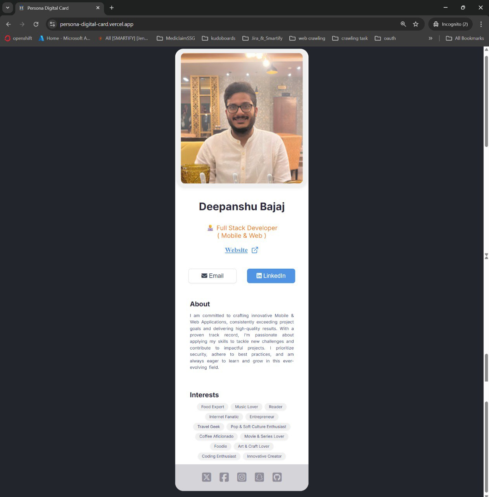
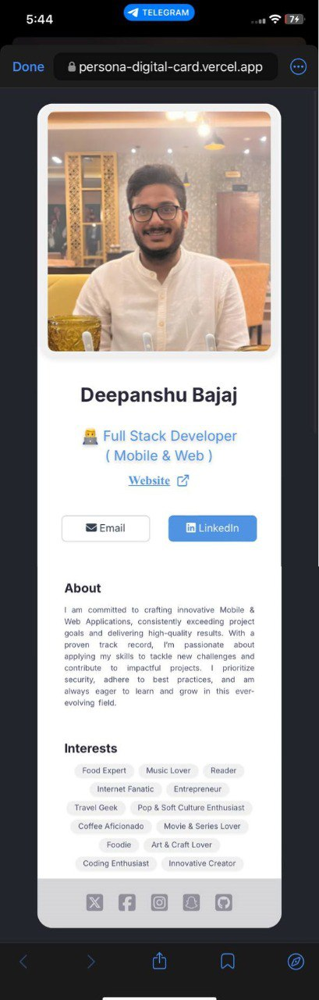

# PersonaDigitalCard
PersonaDigitalCard
<h1 align="center">💼 Persona Digital Card - Personal Web App</h1>

<p align="center">
  <a href="https://persona-digital-card.vercel.app/"><strong>Live Demo</strong></a>
</p>

<p align="center">
  
  
  
</p>

---

## 📌 Overview

**Persona Digital Card** is a personal digital profile built as a modern web app. It functions as a sleek online business card featuring your introduction, contact details, and all your important social and professional links in one place. 

Designed to be fast, responsive, and visually appealing, this app gives visitors a quick yet professional overview of who you are.

---

## ✨ Features

- 🧑‍💼 Personal introduction section  
- 🔗 Clickable links to social media profiles (GitHub, LinkedIn, Twitter, etc.)  
- 📱 Responsive design optimized for all devices  
- ⚡ Fast performance powered by Vite  
- 💻 Built with React + TypeScript  

---

## 🛠 Tech Stack

- **Frontend:** React, JavaScript, Vite
- **Backend:** No Backend required
- **Deployment:** Vercel

---

## 🚀 Getting Started

To run this project locally:

```bash
git clone https://github.com/deepanshubajaj/PersonaDigitalCard.git
```
```bash
npm install
```
```bash
npm run dev     # For local development
```
```bash
vite build   # For production build using Vite or - ' npm run build '
```
---

### 🖼️ Icon / Logo

<p align="center">
  
</p>

<p align="center">
  *This is the App Icon/Logo.*
</p>

---

### 🖼️ UI Sneak Peek

<p align="center">
  
</p>

<p align="center">
  *Screenshot of Persona Digital Card  - PC.*
</p>


<p align="center">
  
</p>


<p align="center">
  *Screenshot of Persona Digital Card  - Mobile.*
</p>

---

## 📱 Live Demo

- 🌐 [Persona Digital Card Live](https://persona-digital-card.vercel.app/)

---

## 🚀 Working App Demo

### Complete App Working Video

Check out the demo of the working app below:

<p align="center">
  
</p>


<p align="center">
  *Complete App Working Video - PC.*
</p>

<p align="center">
  
</p>


<p align="center">
  *Complete App Working Video - Mobile.*
</p>


[🎥 Watch the Working Demo - PC](ProjectOutputs/WorkingVideo/workingVideoPC.mp4)

[🎥 Watch the Working Demo - Mobile](ProjectOutputs/WorkingVideo/workingVideoMobile.MP4)

---

## 🤝 Contributing

Thank you for your interest in contributing to this project!  
I welcome contributions from the community.

- You are free to use, modify, and redistribute this code under the terms of the MIT License.
- If you'd like to contribute, please **open an issue** or **submit a pull request**.
- All contributions will be reviewed and approved by the author — **Deepanshu Bajaj**.

---

## 📃 License

This project is licensed under the [MIT License](./LICENSE).  
You are free to use this project for personal, educational, or commercial purposes — just make sure to provide proper attribution.

> **Clarification:** Commercial use includes, but is not limited to, use in products,  
> services, or activities intended to generate revenue, directly or indirectly.
